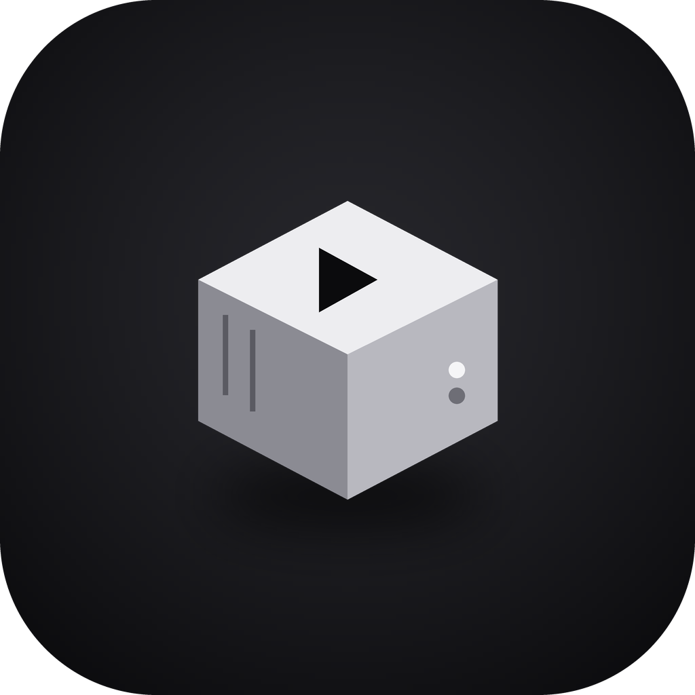

# MartBox

<p align="center">
  
</p>

**MartBox is a self-hosted media server.** It runs on one person's computer and organizes the movies, shows, music and
books they own, so their household and friends can watch, listen and read on their own phone, tablet and TV, at home
or away. It's free and open source: no subscription, no ads, and nothing goes to the cloud.

## What you get

**🎬 Movies and TV**
- Posters, descriptions, cast and trailers, plus a home screen with Continue Watching and picks for the weekend
- Picks up where you left off on any device, with Skip Intro and Up Next
- 4K and HDR on screens that support them; on a slow connection the picture adjusts so it keeps playing
- Your own watchlist, collections and a "Your Year" recap
- A sleep timer for falling asleep to a show

**📺 Live Channels**
- Always-on channels made from the library, like regular TV: tune in and something is already playing

**🙋 Requests**
- Ask for a movie or show that isn't there, and see whether it's been approved

**🎵 Music**
- Albums, artists, songs, genres and search
- Your own playlists, plus Recently Played and Most Played
- Gapless playback (no gaps between tracks), shuffle and repeat, and full-quality lossless audio
- Keeps playing with the screen locked

**🎧 Audiobooks**
- Chapters, playback speed, a sleep timer and skip forward/back
- Your place is saved, so you can start in the car and finish on the couch

**📚 Books and comics**
- EPUB and PDF books, and comics (CBZ, CBR, CB7)
- Light, sepia and dark themes and adjustable text size for books
- For comics: zoom, swipe pages, and a right-to-left mode for manga
- Close a book on one device and open it on another at the same page

**👤 Your own profile**
- Your own profile picture, accent colour, history and place in everything
- Optional PIN to keep your profile yours

## Where it works

| Device | App |
|---|---|
| iPhone and iPad | MartBox for iOS |
| Apple TV | MartBox for Apple TV |
| Android phones and tablets | MartBox for Android |
| Fire TV Stick | MartBox for Android (TV layout) |
| Windows PC and Mac | The MartBox desktop app |

## How to join

The person running the server sends you an invite code (or a QR code). Install the app, enter the code, and you're
in. It works the same at home or away, and nothing needs setting up on your router. Your device stays signed in
until you sign out or the owner removes it.

## Coming next

- **Retro games:** classic console games played with a controller, with your saves following you between devices
- **A fresh new look** across every app
- **Maybe later:** a web browser version, downloads for offline use, and CarPlay / Android Auto

## What's new

See [Releases](https://github.com/matthewtheriault/martbox/releases) for each update. Recent ones:

| Version | What it added |
|---|---|
| 0.18.0 | Books and comics |
| 0.17.0 | Audiobooks |
| 0.16.0 | Music playlists, genres and listening history |
| 0.15.0 | Music |
| 0.14.0 | Skip Intro, Up Next, sleep timer, collections, profile photos, Your Year, trailers |
| 0.12.0 | Android phone and Fire TV app |
| 0.9.0–0.11.0 | Live Channels |
| 0.8.0 | Requests |

---

## For developers

MartBox's server and desktop app (this repo) is built with Electron + React. It scans local library folders,
fetches posters and details from TMDb, and streams to the desktop app and the phone and TV apps. It plays files
directly when it can, and otherwise converts them on the fly with a bundled FFmpeg (using the graphics card when
there is one).

### Getting started (development)

Requirements: Node.js 20+.

```bash
npm install
npm run dev
```

This launches the app in development mode with hot reload.

#### TMDb API key

Metadata lookups require a free TMDb API key:

1. Create an account at https://www.themoviedb.org/
2. Go to **Settings → API** and request a free "Developer" API key (v3 auth)
3. Open MartBox → **Settings** → paste the key under "TMDb API Key" → Save

#### Adding your library

1. Open **Settings**
2. Choose the type (**Movies**, **TV Shows**, **Music**, **Audiobooks** or **Books & Comics**), click **Add Library Folder**, and pick the folder on disk
3. Click **Scan** next to the library — this walks the folder, identifies video files, and matches each one against TMDb

Expected folder conventions:

- **Movies**: `Movies/My Movie (2010)/My Movie (2010).mkv` or `Movies/My Movie (2010).mkv`
- **TV Shows**: `TV/My Show/My.Show.S01E01.mkv` (a subfolder per show; season subfolders are fine too)

### Building an installer

```bash
npm run build:win     # Windows NSIS installer (.exe)
npm run build:mac     # macOS .dmg
npm run build:linux   # Linux AppImage/.deb
```

Output lands in `release/`. Note: building a Windows installer from macOS/Linux typically requires Wine; the included GitHub Actions workflow (`.github/workflows/build-windows.yml`) builds the Windows installer natively on a `windows-latest` runner instead — push to `main` or trigger it manually from the **Actions** tab, then download the artifact (or grab it from a tagged release, e.g. `git tag v0.1.0 && git push --tags`).

### Architecture

- `src/main` — Electron main process: SQLite database (`better-sqlite3`), library scanner, TMDb client, local Express server (streaming + image cache), IPC handlers
- `src/preload` — typed `contextBridge` API exposed to the renderer as `window.api`
- `src/renderer` — React UI (sidebar, hero, poster rows, detail pages, player, settings)
- `src/shared` — types shared between main and renderer

All app data (SQLite DB, cached poster/backdrop images) lives in the OS-standard Electron `userData` directory — nothing is written into your media folders.

#### Playback

Video is served from a local HTTP server (`127.0.0.1`, random port) that Electron talks to directly:

- Files that are already MP4/H.264/AAC are served with HTTP range support for native seeking (direct play).
- Everything else (MKV, AVI, HEVC, AC3/DTS audio, etc.) is transcoded on the fly with a bundled FFmpeg binary. Seeking during transcoded playback restarts the stream at the requested offset (shown as `-30s`/`-10s`/`+10s`/`+30s` controls under the video) rather than using the native scrubber, since the transcoded stream doesn't expose a byte-seekable duration.

## License

MartBox is free software, licensed under the [GNU General Public License v3.0 or later](LICENSE).

MartBox does not include, link to, or help obtain any movies, shows, games, or other media — it only organizes and plays files you already own.
